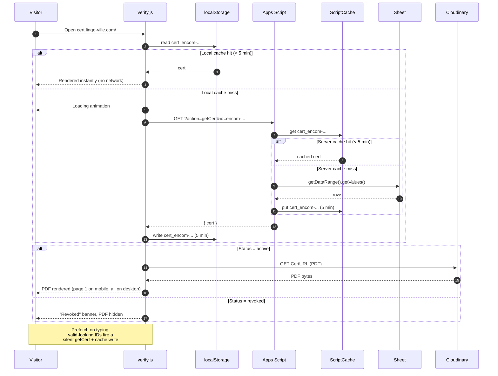

# Certification verification

## how it works in behind the scenes

```mermaid

sequenceDiagram
    autonumber
    participant U  as Visitor
    participant FE as verify.js
    participant LS as localStorage
    participant GS as Apps Script
    participant SC as ScriptCache
    participant SH as Sheet
    participant CL as Cloudinary

    U  ->> FE: Open cert.lingo-ville.com/#/encom-...
    FE ->> LS: read cert_encom-...

    alt Local cache hit (< 5 min)
        LS -->> FE: cert
        FE -->> U: Rendered instantly (no network)
    else Local cache miss
        FE -->> U: Loading animation
        FE ->> GS: GET ?action=getCert&id=encom-...
        GS ->> SC: get cert_encom-...
        alt Server cache hit (< 5 min)
            SC -->> GS: cached cert
        else Server cache miss
            GS ->> SH: getDataRange().getValues()
            SH -->> GS: rows
            GS ->> SC: put cert_encom-... (5 min)
        end
        GS -->> FE: { cert }
        FE ->> LS: write cert_encom-... (5 min)
    end

    alt Status = active
        FE ->> CL: GET CertURL (PDF)
        CL -->> FE: PDF bytes
        FE -->> U: PDF rendered (page 1 on mobile, all on desktop)
    else Status = revoked
        FE -->> U: "Revoked" banner, PDF hidden
    end

    Note over FE,U: Prefetch on typing:<br/>valid-looking IDs fire a<br/>silent getCert + cache write

```
